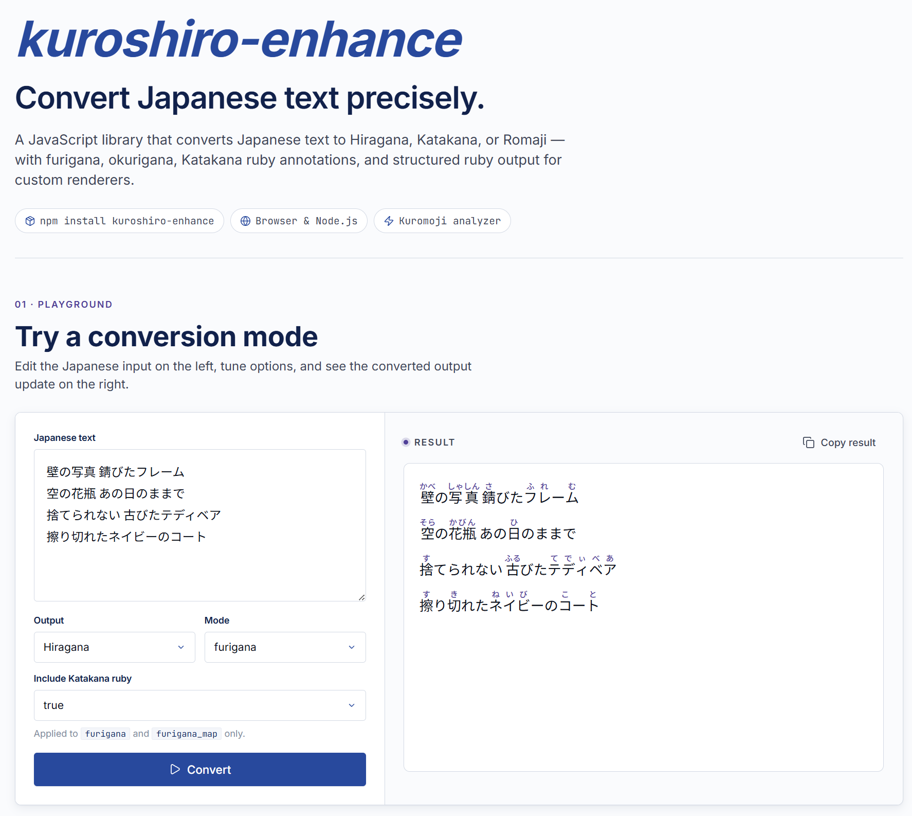

# kuroshiro-enhance

[](https://www.npmjs.com/package/kuroshiro-enhance)
[](LICENSE)

kuroshiro-enhance is a fork of the original kuroshiro for converting Japanese text to Hiragana, Katakana, or Romaji. It supports furigana, okurigana, multiple analyzers, and structured ruby output for custom rendering.

Demo: [gene891212.github.io/kuroshiro-enhance](https://gene891212.github.io/kuroshiro-enhance)



## Highlights

Compared with the original kuroshiro, this fork adds structured ruby output and optional Katakana ruby annotations for custom furigana rendering.

| Feature | kuroshiro (original) | kuroshiro-enhance |
| ------- | -------------------- | ----------------- |
| Basic conversion (Hiragana / Katakana / Romaji) | ✓ | ✓ |
| Furigana and okurigana modes | ✓ | ✓ |
| Katakana ruby annotations | - | ✓ (`includeKatakana`) |
| Structured ruby output | - | ✓ (`furigana_segments`) |

## Table of Contents

- [Highlights](#highlights)
- [Quick Start](#quick-start)
- [Usage](#usage)
- [Analyzer Plugins](#analyzer-plugins)
- [API](#api)
- [Breaking Changes](#breaking-changes)
- [Contributing](#contributing)
- [Credits](#credits)
- [License](#license)

## Quick Start

> **Prerequisite:** Node.js >= 18 is required for Node.js usage and local development.

Install the library and an analyzer plugin:

```sh
npm install kuroshiro-enhance kuroshiro-analyzer-kuromoji
# or
pnpm add kuroshiro-enhance kuroshiro-analyzer-kuromoji
# or
yarn add kuroshiro-enhance kuroshiro-analyzer-kuromoji
```

Recommended default analyzer: `kuroshiro-analyzer-kuromoji`.

Convert Japanese text with the Kuromoji analyzer. `furigana` mode returns an HTML string; render it as HTML in your UI if you want browser ruby display.

```js
import Kuroshiro from "kuroshiro-enhance";
import KuromojiAnalyzer from "kuroshiro-analyzer-kuromoji";

const kuroshiro = new Kuroshiro();
await kuroshiro.init(new KuromojiAnalyzer());

const result = await kuroshiro.convert("感じ取れたら手を繋ごう", {
  to: "hiragana",
  mode: "furigana",
  includeKatakana: true,
});

console.log(result);
// <ruby>感<rp>(</rp><rt>かん</rt><rp>)</rp></ruby>じ<ruby>取<rp>(</rp><rt>と</rt><rp>)</rp></ruby>れたら<ruby>手<rp>(</rp><rt>て</rt><rp>)</rp></ruby>を<ruby>繋<rp>(</rp><rt>つな</rt><rp>)</rp></ruby>ごう
```

Use `mode: "furigana_segments"` when you need structured ruby data instead of HTML. It returns a flat array of segments that you can render with a single `map`, with no index bookkeeping:

```js
const result = await kuroshiro.convert("古びたテディベア", {
  to: "hiragana",
  mode: "furigana_segments",
  includeKatakana: true,
});

console.log(result);
// [
//   { text: "古", ruby: "ふる" },
//   { text: "びた" },
//   { text: "テ", ruby: "て" },
//   { text: "デ", ruby: "で" },
//   ...
// ]
```

Rendering is a one-liner (React shown here); newlines come through as their own `{ text: "\n" }` segments:

```jsx
result.map((seg, i) =>
  seg.text === "\n" ? <br key={i} />
  : seg.ruby ? <ruby key={i}>{seg.text}<rt>{seg.ruby}</rt></ruby>
  : seg.text,
);
```

> `mode: "furigana_map"` still works but is **deprecated** and will be removed in the next major version. See the [convert options](#convertstr-options) below for migration.

## Usage

### Browser

`kuroshiro.min.js` does not include analyzer plugins or dictionary files. In the browser, load both kuroshiro and an analyzer bundle, then pass the analyzer a `dictPath`.

Using CDN bundles:

```html
<script src="https://unpkg.com/kuroshiro-enhance@latest/dist/kuroshiro.min.js"></script>
<script src="https://unpkg.com/kuroshiro-analyzer-kuromoji@1.1.0/dist/kuroshiro-analyzer-kuromoji.min.js"></script>
```

Using a local build:

```sh
npm install
npm run build
```

Then load the generated bundle and an analyzer bundle in your HTML:

```html
<script src="dist/kuroshiro.min.js"></script>
<script src="url/to/kuroshiro-analyzer-kuromoji.min.js"></script>
```

Initialize kuroshiro with an analyzer instance:

```js
const KuroshiroClass = window.Kuroshiro.default || window.Kuroshiro;
const kuroshiro = new KuroshiroClass();

kuroshiro
  .init(new KuromojiAnalyzer({ dictPath: "url/to/dictFiles" }))
  .then(function () {
    return kuroshiro.convert(
      "感じ取れたら手を繋ごう、重なるのは人生のライン and レミリア最高！",
      { to: "hiragana" },
    );
  })
  .then(function (result) {
    console.log(result);
  });
```

### Node.js CommonJS

```js
const Kuroshiro = require("kuroshiro-enhance").default;
const KuromojiAnalyzer = require("kuroshiro-analyzer-kuromoji");

(async () => {
  const kuroshiro = new Kuroshiro();
  await kuroshiro.init(new KuromojiAnalyzer());

  const result = await kuroshiro.convert(
    "感じ取れたら手を繋ごう、重なるのは人生のライン and レミリア最高！",
    { to: "hiragana" },
  );

  console.log(result);
})();
```

## Analyzer Plugins

_You should check the environment compatibility of each analyzer before you start working with them._

| Analyzer      | Node.js Support | Browser Support | Plugin Repo                                                                                  | Developer                             |
| ------------- | --------------- | --------------- | -------------------------------------------------------------------------------------------- | ------------------------------------- |
| Kuromoji      | ✓               | ✓               | [kuroshiro-analyzer-kuromoji](https://github.com/hexenq/kuroshiro-analyzer-kuromoji)         | [Hexen Qi](https://github.com/hexenq) |
| Mecab         | ✓               | ✗               | [kuroshiro-analyzer-mecab](https://github.com/hexenq/kuroshiro-analyzer-mecab)               | [Hexen Qi](https://github.com/hexenq) |
| Yahoo Web API | ✓               | ✗               | [kuroshiro-analyzer-yahoo-webapi](https://github.com/hexenq/kuroshiro-analyzer-yahoo-webapi) | [Hexen Qi](https://github.com/hexenq) |

## API

### Constructor

**Examples**

```js
const kuroshiro = new Kuroshiro();
```

### Instance Methods

#### init(analyzer)

Initialize kuroshiro with an analyzer instance. You can use one of the [Analyzer Plugins](#analyzer-plugins) listed above, or provide a custom analyzer that implements the same interface.

**Arguments**

- `analyzer` - An instance of analyzer.

**Examples**

```js
await kuroshiro.init(new KuromojiAnalyzer());
```

#### convert(str, [options])

Convert given string to target syllabary with options available

**Arguments**

- `str` - A String to be converted.
- `options` - _Optional_ kuroshiro has several convert options as below.

| Options                   | Type    | Default    | Description                                                                                           |
| ------------------------- | ------- | ---------- | ----------------------------------------------------------------------------------------------------- |
| to                        | String  | "hiragana" | Target syllabary [`hiragana`, `katakana`, `romaji`]                                                   |
| mode                      | String  | "normal"   | Convert mode [`normal`, `spaced`, `okurigana`, `furigana`, `furigana_segments`, `furigana_map`<sup>†</sup>]                            |
| includeKatakana           | boolean | false      | In `furigana`, `furigana_segments` and `furigana_map` modes, also add ruby annotations to Katakana characters when `true`. |
| romajiSystem<sup>\*</sup> | String  | "hepburn"  | Romanization system [`nippon`, `passport`, `hepburn`]                                                 |
| delimiter_start           | String  | "("        | Delimiter(Start)                                                                                      |
| delimiter_end             | String  | ")"        | Delimiter(End)                                                                                        |

\*_: Param `romajiSystem` is only applied when the value of param `to` is `romaji`. For more about it, check [Romanization System](#romanization-system)_

†_: `furigana_map` is **deprecated** and will be removed in the next major version. Use `furigana_segments` instead — it returns easier-to-render data and covers the same cases. Calling `furigana_map` logs a one-time deprecation warning per instance._

**Examples**

```js
// normal
await kuroshiro.convert(
  "感じ取れたら手を繋ごう、重なるのは人生のライン and レミリア最高！",
  { to: "hiragana" },
);
// result：かんじとれたらてをつなごう、かさなるのはじんせいのライン and レミリアさいこう！
```

```js
// spaced
await kuroshiro.convert(
  "感じ取れたら手を繋ごう、重なるのは人生のライン and レミリア最高！",
  { to: "hiragana", mode: "spaced" },
);
// result：かんじとれ たら て を つなご う 、 かさなる の は じんせい の ライン   and   レミ リア さいこう ！
```

```js
// okurigana
await kuroshiro.convert(
  "感じ取れたら手を繋ごう、重なるのは人生のライン and レミリア最高！",
  { to: "hiragana", mode: "okurigana" },
);
// result: 感(かん)じ取(と)れたら手(て)を繋(つな)ごう、重(かさ)なるのは人生(じんせい)のライン and レミリア最高(さいこう)！
```

```js
// furigana
await kuroshiro.convert(
  "感じ取れたら手を繋ごう、重なるのは人生のライン and レミリア最高！",
  { to: "hiragana", mode: "furigana" },
);
// result: <ruby>感<rp>(</rp><rt>かん</rt><rp>)</rp></ruby>じ<ruby>取<rp>(</rp><rt>と</rt><rp>)</rp></ruby>れたら<ruby>手<rp>(</rp><rt>て</rt><rp>)</rp></ruby>を<ruby>繋<rp>(</rp><rt>つな</rt><rp>)</rp></ruby>ごう、<ruby>重<rp>(</rp><rt>かさ</rt><rp>)</rp></ruby>なるのは<ruby>人生<rp>(</rp><rt>じんせい</rt><rp>)</rp></ruby>のライン and レミリア<ruby>最高<rp>(</rp><rt>さいこう</rt><rp>)</rp></ruby>！
```

```js
// furigana_segments
await kuroshiro.convert("古びたテディベア", {
  to: "hiragana",
  mode: "furigana_segments",
  includeKatakana: true,
});
// result:
[
  { "text": "古", "ruby": "ふる" },
  { "text": "びた" },
  { "text": "テ", "ruby": "て" },
  { "text": "デ", "ruby": "で" },
  { "text": "ィ", "ruby": "ぃ" },
  { "text": "ベ", "ruby": "べ" },
  { "text": "ア", "ruby": "あ" }
]
```

Each entry is a `FuriganaSegment`:

- `text`: A slice of the original input. Concatenating every `text` reproduces the input exactly.
- `ruby`: The reading for that slice. Present only on segments that carry ruby (kanji, or katakana when `includeKatakana` is `true`); absent on plain text.

Newlines are emitted as their own ruby-less segments (`{ text: "\n" }`) and never merged into surrounding text, so you can map them straight to `<br>`.

```js
// furigana_map (deprecated — use furigana_segments)
await kuroshiro.convert("古びたテディベア", {
  to: "hiragana",
  mode: "furigana_map",
  includeKatakana: true,
});
// result:
{
  "text": "古びたテディベア",
  "ruby": [
    { "s": 0, "e": 1, "rt": "ふる" },
    { "s": 3, "e": 4, "rt": "て" },
    { "s": 4, "e": 5, "rt": "で" },
    { "s": 5, "e": 6, "rt": "ぃ" },
    { "s": 6, "e": 7, "rt": "べ" },
    { "s": 7, "e": 8, "rt": "あ" }
  ]
}
```

In `furigana_map` results:

- `text`: The original text.
- `ruby`: Ruby annotation spans for `text`.
- `s`: Start character index.
- `e`: End character index, exclusive.
- `rt`: Ruby text, or reading.

### Utils

**Examples**

```js
const result = Kuroshiro.Util.isHiragana("あ");
```

#### isHiragana(char)

Check if input char is hiragana.

#### isKatakana(char)

Check if input char is katakana.

#### isKana(char)

Check if input char is kana.

#### isKanji(char)

Check if input char is kanji.

#### isJapanese(char)

Check if input char is Japanese.

#### hasHiragana(str)

Check if input string has hiragana.

#### hasKatakana(str)

Check if input string has katakana.

#### hasKana(str)

Check if input string has kana.

#### hasKanji(str)

Check if input string has kanji.

#### hasJapanese(str)

Check if input string has Japanese.

#### kanaToHiragana(str)

Convert input kana string to hiragana.

> The misspelled legacy name `kanaToHiragna` is kept as a deprecated alias and will be removed in the next major version.

#### kanaToKatakana(str)

Convert input kana string to katakana.

#### kanaToRomaji(str, system)

Convert input kana string to romaji. Param `system` accepts `"nippon"`, `"passport"`, `"hepburn"` (Default: "hepburn").

## Romanization System

kuroshiro supports three kinds of romanization systems.

`nippon`: Nippon-shiki romanization. See [ISO 3602 Strict](http://www.age.ne.jp/x/nrs/iso3602/iso3602.html) for the reference table.

`passport`: Passport-shiki romanization. See the [Japanese romanization table](https://www.ezairyu.mofa.go.jp/passport/hebon.html) published by the Ministry of Foreign Affairs of Japan.

`hepburn`: Hepburn romanization. See [BS 4812 : 1972](https://archive.is/PiJ4) for the reference standard.

There is a useful [webpage](http://jgrammar.life.coocan.jp/ja/data/rohmaji2.htm) for you to check the difference between these romanization systems.

### Notice for Romaji Conversion

It is impossible to fully automatically convert **furigana** directly to **romaji** because furigana lacks some pronunciation information. The article [なぜ フリガナでは ダメなのか？](https://green.adam.ne.jp/roomazi/onamae.html#naze) explains the ambiguity.

kuroshiro will not handle chōon when processing directly furigana (kana) -> romaji conversion with every romanization system (Except that Chōonpu will be handled)

_For example, you'll get "kousi", "koushi", "koushi" respectively when converts kana "こうし" to romaji
using `nippon`, `passport`, `hepburn` romanization system._

The kanji -> romaji conversion with/without furigana mode is **unaffected** by this logic.

## Breaking Changes

See [CHANGELOG.md](CHANGELOG.md) for version history.

### Deprecations (still working, removed in the next major)

- **`furigana_map` mode** → use [`furigana_segments`](#convertstr-options). It returns a flat `FuriganaSegment[]` that renders without index bookkeeping and handles newlines. Calling `furigana_map` logs a one-time warning per instance.
- **`Kuroshiro.Util.kanaToHiragna`** → use `kanaToHiragana` (the old name was missing an "a").

### v2.x

- **Node.js Environment Requirement**: Kuroshiro now requires Node.js >= 18.0.0.
- **CommonJS Require Syntax**: Since the codebase outputs CommonJS through `.cjs` exports, standard CommonJS imports should use `.default`: `const Kuroshiro = require("kuroshiro-enhance").default;`
- **TypeScript Strictness**: Type definitions are now bundled, so TypeScript users may see compiler errors for invalid options or parameters.

### v1.x

- Separated morphological analyzer logic from phonetic notation logic, allowing different analyzers from [Analyzer Plugins](#analyzer-plugins) or custom analyzers.
- Embraced ES8/ES2017 and async/await.
- Switched to ES Modules instead of CommonJS.

## Contributing

Please check [CONTRIBUTING](CONTRIBUTING.md).

## Credits

- [kuroshiro](https://github.com/hexenq/kuroshiro) by [Hexen Qi](https://github.com/hexenq), the original project this fork is based on.
- kuromoji
- wanakana

## License

[MIT License](LICENSE)
